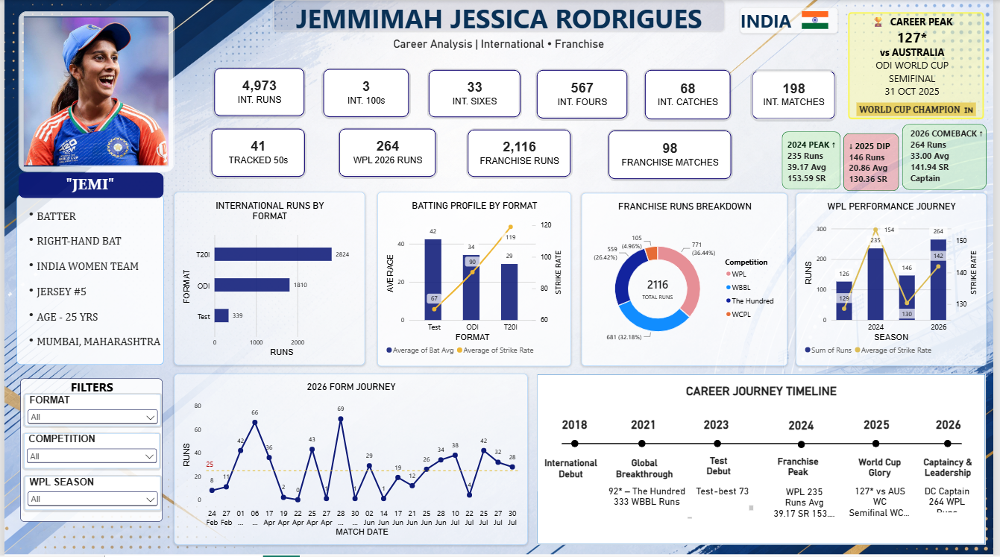

# Jemimah-Rodrigues-Cricket-Analytics-Dashboard
Power BI dashboard analyzing Jemimah Rodrigues' international and franchise cricket performance.

## Project Overview

This project is an interactive **Power BI Cricket Analytics Dashboard** developed to analyze the career performance of Indian cricketer **Jemimah Jessica Rodrigues**.

The dashboard provides insights into her **international and franchise cricket career**, including runs, batting performance, strike rate, career milestones, WPL performance, and recent form.

The main objective of this project is to transform cricket statistics into meaningful and easy-to-understand visual insights using **Power BI**.

---

## Dashboard Preview

---

## Project Objectives

- Analyze Jemimah Rodrigues' international cricket performance
- Compare batting performance across Test, ODI and T20I formats
- Analyze performance across different franchise competitions
- Track WPL performance across seasons
- Study recent batting form and consistency
- Highlight important career milestones and achievements
- Present cricket statistics through an interactive Power BI dashboard

---

## Key Performance Indicators (KPIs)

The dashboard highlights several important career statistics:

- **4,973 International Runs**
- **198 International Matches**
- **3 International Centuries**
- **41 Tracked Half-Centuries**
- **567 International Fours**
- **33 International Sixes**
- **68 International Catches**
- **2,116 Franchise Runs**
- **98 Franchise Matches**
- **264 WPL Runs in 2026**

---

## Dashboard Visualizations

### 1. International Runs by Format
Displays the total international runs scored across:

- T20I
- ODI
- Test

This helps compare performance across different international formats.

### 2. Batting Profile by Format
Compares:

- Batting Average
- Strike Rate

across Test, ODI and T20I cricket.

### 3. Franchise Runs Breakdown
Shows the distribution of franchise runs across competitions such as:

- WPL
- WBBL
- The Hundred
- WCPL

### 4. WPL Performance Journey
Tracks Jemimah's WPL performance across seasons using:

- Runs
- Strike Rate

This helps identify improvements, dips and comeback performances.

### 5. 2026 Form Journey
A match-by-match visualization showing runs scored during 2026.

It helps analyze:

- Recent form
- Consistency
- High-scoring innings
- Low-scoring innings
- Overall batting trend

### 6. Career Journey Timeline
Highlights major milestones in Jemimah Rodrigues' cricket career from **2018 to 2026**, including:

- International Debut
- Global Breakthrough
- Test Debut
- Franchise Peak
- World Cup Performance
- Captaincy and Leadership

---

## Interactive Filters

The dashboard includes interactive slicers that allow users to filter the analysis by:

- **Format**
- **Competition**
- **WPL Season**

These filters make the dashboard interactive and allow users to explore specific areas of performance.

---

## Key Insights

- T20I contributes the largest share of Jemimah Rodrigues' international runs.
- Her batting profile varies significantly across Test, ODI and T20I formats.
- WPL and WBBL make major contributions to her franchise career runs.
- The WPL journey visualization highlights changes in both runs and strike rate across seasons.
- Match-level analysis provides a clear picture of her recent form and consistency.
- Career milestones show her progression from international debut to major tournament performances and leadership responsibilities.

---

## Tools & Technologies Used

- **Power BI** – Dashboard development and data visualization
- **Power Query** – Data transformation and preparation
- **DAX** – Measures and calculated insights
- **Microsoft Excel** – Dataset preparation and storage

---

## Project Files

| File | Description |
|------|-------------|
| `Jemimah project.pbix` | Main Power BI dashboard file |
| `Jemimah_International_Career.xlsx` | International career dataset |
| `Jemimah_Franchise_Career.xlsx` | Franchise cricket dataset |
| `Jemimah_Profile.xlsx` | Player profile dataset |
| `Jemimah_Recent_2026.xlsx` | Recent 2026 performance dataset |
| `Dashboard_Preview.png.png` | Dashboard preview image |

---

## Skills Demonstrated

This project demonstrates practical knowledge of:

- Data Visualization
- Data Cleaning & Transformation
- Power BI Dashboard Development
- DAX
- Power Query
- Data Modeling
- KPI Development
- Interactive Slicers
- Data Analysis
- Storytelling with Data

---

## Author

**Abhilipsa Anindita**

B.Tech – Computer Science & Engineering  
Aspiring Data Analyst

---

⭐ If you found this project interesting, feel free to explore the dashboard and project files.
